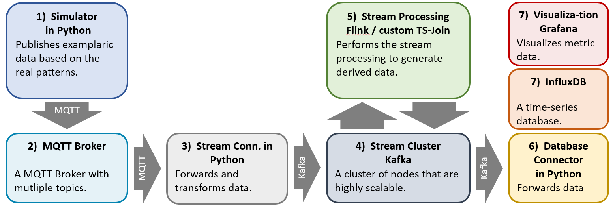
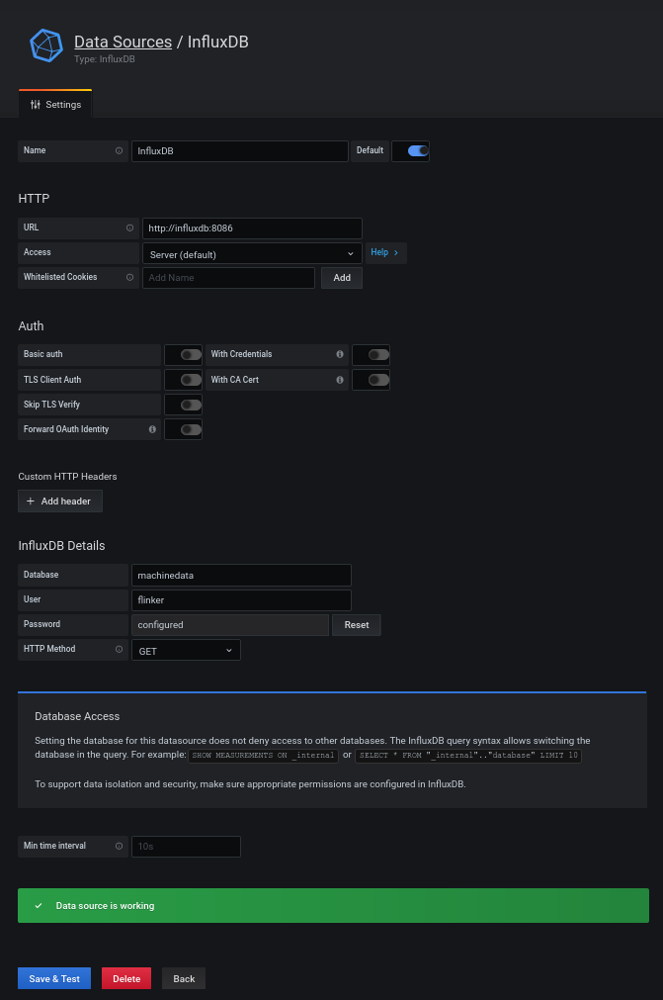

# Stateful Stream Processor

This project is an end-to-end example to demonstrate 
stateful stream processing on very high throughput of 
machine data.




The setup and **how to start the data streaming** 
is documented below and tested on Ubuntu 18.04 LTS.


---

<br>

# Deployment Notes


## 1. Simulator

Unzip the events in `01_Simulator` with the name `events.json`.
This file has 1402232 rows with different number of values each.

```bash
cd 01_Simulator
python3 simulator.py
```

Set the variables with in `simulator.py`. The defauls are

* BROKER_HOST = "localhost"
* BROKER_PORT = 1883
* EVENT_FILE = "events.json"
* TOPIC_NAME = "machine/states"
* SAMPLE_RATE = 1000

The maximum sample rate is around 1 kS/s.

## 2. MQTT Broker

This step requires a running docker-compose installation. Therefore, run:

1. Install [Docker](https://www.docker.com/community-edition#/download) version **1.10.0+**
2. Install [Docker Compose](https://docs.docker.com/compose/install/) version **1.6.0+**

To set up the MQTT Broker locally with the default
port of `1883`, run:

```bash
cd 02_MQTT_Broker
docker-compose up --build -d
```

To check if the service is available or 
to stop it, run:

```bash
cd 02_MQTT_Broker
docker-compose ps
docker-compose logs
docker-compose stop
```


## 3. Stream Connector

To install the requirements for the Stream Connector, run these lines:

```bash
# Install Kafka version 2.5 to /kafka
cd 03_Stream_Connector
bash install_kafka_libs-1v4.sh
pip install confluent-kafka==1.4.2
```


## 4. Kafka

To setup Apache Kafka, run these lines:

```bash
# Install Kafka version 2.5 to /kafka
cd 04_Kafka
bash install_kafka-2v5.sh
# Copy the systemd service files
sudo cp zookeeper.service /etc/systemd/system/zookeeper.service 
sudo cp kafka.service /etc/systemd/system/kafka.service 
```

Update services and enable auto-start:
```bash
sudo systemctl enable kafka
sudo systemctl enable zookeeper
```

Then (re-) start the services.
```bash
sudo systemctl stop zookeeper
sudo systemctl stop kafka
sudo systemctl restart zookeeper
sudo systemctl status --no-pager zookeeper
sudo systemctl restart kafka
sudo systemctl status --no-pager kafka
```

For a more detailed investigation `sudo journalctl -b -u zookeeper.service -f`
is useful (or use other parameters as `-e`)!


Now, we can create our topic with the specified configs. Note that the MQTT records are streamed to the topic
`machine.data`. Flink consumes records from this topic, processes them and writes the aggregated records to 
`machine.out`.

```bash
/kafka/bin/kafka-topics.sh --bootstrap-server localhost:9092 --create --topic machine.data --replication-factor 1 --partitions 5 --config cleanup.policy=compact --config retention.ms=172800000
/kafka/bin/kafka-topics.sh --bootstrap-server localhost:9092 --create --topic machine.out --replication-factor 1 --partitions 3 --config cleanup.policy=compact --config retention.ms=172800000
# check if the topic was created with the correct configs:
/kafka/bin/kafka-topics.sh --bootstrap-server :2181 --describe --topic machine.data
```

Here are some other useful command for
```bash
/kafka/bin/kafka-topics.sh --bootstrap-server localhost:9092 --list
/kafka/bin/kafka-topics.sh --bootstrap-server :2181 --delete --topic machine.data
```

In order to test the installation, open two terminal windows and start
the consumer and producer instance each:
```bash
/kafka/bin/kafka-console-producer.sh --broker-list 127.0.0.1:9092 --topic machine.data --property parse.key=true --property key.separator=,
/kafka/bin/kafka-console-consumer.sh --bootstrap-server 127.0.0.1:9092 --topic machine.data --from-beginning --property print.key=true --property key.separator=,
```
After that, you can stream messages of the form `[key],[value]` from the producer to the consumer,
e.g. `0,helloKafka`.


## 5. Stream Processing

### Flink in Java

Download Flink and extract to `/flink`:
```bash
wget https://mirror.klaus-uwe.me/apache/flink/flink-1.10.1/flink-1.10.1-bin-scala_2.12.tgz
tar -xvf flink-1.10.1-bin-scala_2.12.tgz
sudo cp -a flink-1.10.1 /flink
rm -r flink-1.10.1
cd /flink
```
To start the GUI of Flink on [localhost:8081](http://localhost:8081/#/), 
and try a WordCount example, run:
```bash
/flink/bin/start-cluster.sh
/flink/bin/flink run /flink/examples/streaming/WordCount.jar --input $(pwd)/01_Simulator/events.json --output $(pwd)/01_Simulator/eventsWordCount.out
```

The directory `05_Flink_Java` is an Intellij project, in that the class
`src/main/java/com/github/statful/StreamJoiner.java` successfully forwards data 
from `machine.data` to `machine.out` and merges two types of metrics.
Therefore, create a new maven/java project with Intelliji IDEA and 
make sure to install all maven dependencies from `pom.xml`.

You can also create a jar file from the java project with a maven `clean` and `install`.
The resulting file `target/StreamJoiner.jar` can be uploaded to the 
[local Flink Cluster](http://localhost:8081) and deployed. 
This doesn't work at the moment.

In both cases, you can check if the forwarding works by watching new arriving data via:
(make sure that there is data in the topic `machine.data`)
```bash
/kafka/bin/kafka-console-consumer.sh --bootstrap-server 127.0.0.1:9092 --topic machine.out --property print.key=true --property key.separator=,
```

#### TODOs:

 - [ ] Intelligent windowing
 - [ ] Create config file for calculations

### Flink in Python

(not working)

Load the required Jar files into `/flink/lib`, which can be found on [maven](https://search.maven.org/search?q=flink%20kafka).

```
flink-connector-kafka_2.12-1.10.1.jar       
flink-json-1.10.1.jar                  
flink-connector-kafka-base_2.12-1.10.1.jar  
flink-sql-connector-kafka_2.11-1.10.0.jar  
kafka-clients-2.5.0.jar             
log4j-1.2.17.jar
```
Then, it should be possible to test the word count test:

```bash
/flink/bin/start-cluster.sh
/flink/bin/flink run -py 06_Flink_Python/WordCount.py
```
This writes an output file into `tmp/results`.


To install Pyflink, simply run:

```bash
pip install apache-flink
```

More has not been tested yet. 


## 6. DB Connector

The Database Connector consumes Messages from Kafka, both from 
the topic `machine.data` and `machine.out`, and forwards them
to InfluxDB via RestAPI.

This step requires a reachable InfluxDB endpoint on [localhost:8086](localhost:8086).
To start the application, run:

```bash
cd 06_DB_Connector
python db_connector.py
``` 

In the connector, the package [influxdb-python](https://influxdb-python.readthedocs.io/en/latest/include-readme.html)
was used.

## 7. InfluxDB and Grafana

### Setup

Update the configurations in the environment file `08_InfluxDB/.env`.
**Change the password immediately and never commit this file if the service is available from other 
nodes!** 

To start InfluxDB and also Grafana, run`
```bash
cd 07_InfluxDB_Grafana
docker-compose up -d
``` 

To validate, if InfluxDB is running correctly, curl the service 
using:

```bash
curl -sl -I http://localhost:8086/ping
# Expected result, note the status code 204
HTTP/1.1 204 No Content
Content-Type: application/json
Request-Id: 2f7091fb-9daa-11ea-8002-0242ac110002
X-Influxdb-Build: OSS
X-Influxdb-Version: 1.8.0
X-Request-Id: 2f7091fb-9daa-11ea-8002-0242ac110002
Date: Sun, 24 May 2020 10:34:45 GMT
```

Grafana is started with InfluxDB and is reachable on
[localhost:3000](http://localhost:3000).


To investigate the services or 
to stop them, run:

```bash
docker-compose ps
docker-compose logs [influxDB|Grafana]
docker-compose stop
```

### First steps in InfluxDB

InfluxDB provides a RestAPI that can be executed via `curl`

```bash
curl -XPOST 'http://localhost:8086/query' --data-urlencode 'q=CREATE DATABASE "mydb"'
curl -XPOST 'http://localhost:8086/query?db=mydb' --data-urlencode 'q=SELECT * INTO "newmeas" FROM "mymeas"'
curl -G 'http://localhost:8086/query?db=mydb&pretty=true' --data-urlencode 'q=SELECT * FROM "mymeas"'
```
More API interface examples can be found [here](https://docs.influxdata.com/influxdb/v1.8/tools/api/).

It is important, that the attributes `time` and all `tags` are
the primary key and must be unique.

### First steps in Grafana

Grafana is started with InfluxDB and is reachable on
[localhost:3000](http://localhost:3000).

To retrieve data from the InfluxDB, add a new data source by 
clicking on `Configuration -> Data Sources -> Add data source`.
Then fill the fields as shown in this screenshot:

   

The password is set in the environment file `08_InfluxDB/.env`.
As you can see in the green box, the test was successful!

Afterwards, a dashboard can be created that retrieves data from
InfluxDB. Therefore, click on `+ -> Dashboard` and then build a
dashboard from scratch. However, it is also possible to import
a dashboard that was previously exported.

